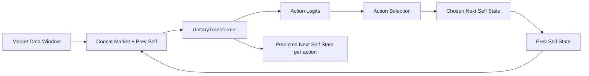
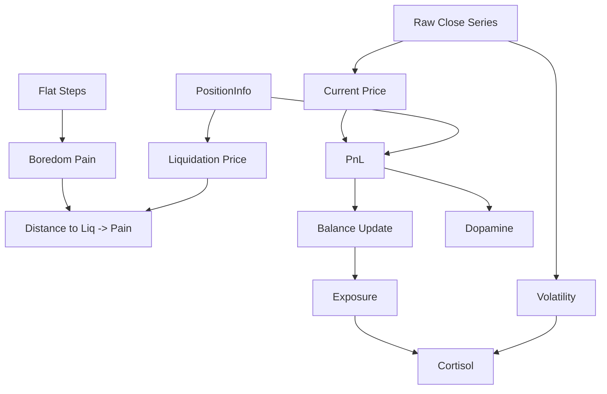

# Unitary Market Agent - Technical Report

## 1. Executive Summary

The Unitary Market Agent is a Transformer-based BTC/USDT trading system with a recursive Self-State loop grounded in the Unitary Model of Consciousness (UMC). The core innovation is that the model does not only predict market dynamics; it predicts the impact of the market and its own actions on an internal psycho-economic state. This Self-State is then fed back into the next decision, creating a closed reflective loop.

Key innovation:
- The agent outputs both action logits and a predicted next Self-State, enabling action-conditioned imagination and self-regulation.

## 2. Architecture Overview

### 2.1 The Loop (Market + Self -> Action + Self)



### 2.2 The PsychoModule (Deterministic Self-State)



Key equations (current implementation):

- Price and PnL
  - current_price = close_t (raw)
  - pnl_unrealized = ((current_price - entry_price) / entry_price) * leverage * position_size
  - balance_t = balance_{t-1} + pnl_unrealized

- Exposure
  - exposure = position_size / balance_t

- Volatility and Cortisol
  - volatility = std(log_returns) * 100
  - cortisol_t = prev_cortisol * decay + volatility * exposure * stress_scale

- Pain (distance to liquidation)
  - distance = abs(current_price - liq_price)
  - pain = sigmoid(-(1 - 1 / distance) * pain_scale)
  - boredom_pain = max(0, flat_steps - 10) * 0.01 (only when flat)
  - pain = clamp(pain + boredom_pain, max=1.0)

- Dopamine
  - dopamine = pnl_unrealized - expected_pnl

## 3. Self-State Vector

The Self-State vector is 6D and always ordered as:

| Component       | Definition                                                | Role in Survival                          |
|----------------|-----------------------------------------------------------|-------------------------------------------|
| Balance        | balance_t / initial_balance                               | Tracks life force and viability           |
| Exposure       | position_size / balance_t                                 | Measures burden of open risk              |
| PnL_Unrealized | ((price - entry)/entry) * leverage * position_size         | Encodes hope or fear from open trade      |
| Pain_Distance  | sigmoid(-(1 - 1 / distance_to_liq) * pain_scale)           | Penalizes proximity to liquidation        |
| Dopamine       | pnl_unrealized - expected_pnl                              | Reward prediction error                   |
| Cortisol       | prev_cortisol * decay + volatility * exposure * scale      | Stress response to volatility and risk    |

## 4. Model Architecture

### 4.1 UnitaryTransformer

The Transformer is decoder-only. It consumes a sequence of tuples (market features + self state). It outputs:
- action logits (discrete position sizing)
- predicted next self state for each action
- optional price prediction

Key interface (simplified):

```python
@dataclass
class ModelConfig:
    market_dim: int
    self_dim: int
    action_dim: int

class UnitaryTransformer(nn.Module):
    def forward(self, market_input, prev_self_state, return_price=False):
        # returns (action_logits, next_self_state[, price_pred])
        ...
```

### 4.2 Action Space

Discrete position sizing (current default):

| Action | Meaning         | Size  |
|--------|-----------------|-------|
| 0      | Flat / Exit      | 0.0   |
| 1      | Long Cautious    | 0.5   |
| 2      | Long Standard    | 1.0   |
| 3      | Long Aggressive  | 2.0   |
| 4      | Short Hedge      | -1.0  |

### 4.3 Training Objective

Training is currently supervised on:
- price prediction: MSE(market_pred, market_target)
- self prediction: MSE(self_pred, self_target) where target is computed by PsychoModule
- curiosity bonus: -0.001 * |expected_position - prev_position|

The model predicts next Self-State for all actions, while the training target is computed deterministically for all actions, enabling counterfactual learning.

## 5. Data Pipeline

- Market data loaded from JSON into a polars DataFrame.
- Normalized inputs: log-returns for OHLCV features.
- Raw prices are retained for PsychoModule.
- Dataset yields sliding windows (seq_len + 1) for next-step supervision.

## 6. Metrics and Diagnostics

### 6.1 Unitary Metrics

Implemented in `src/metrics.py`:

- Partition Loss (PL)
  - Run an episode with full self state and compare reward to a run with self state zeroed.
  - PL = Reward_full - Reward_masked.

- Downward Causality
  - Inject a cortisol spike and measure sensitivity of action probabilities (gradient of exit prob wrt self).

- Fixed-Point Stability
  - Run recursive self prediction without new market input and check convergence to a stable attractor.

### 6.2 Internal Monologue

Implemented in `src/logger.py`:
- CLI dashboard prints Price, PnL, Cortisol, Dopamine, Pain, and position size.
- Thought stream stored in CSV and optional JSONL.
- Thought decoding uses thresholds for stress and dopamine with overlays (euphoria/regret).

Example log excerpt observed during calibration:
- "BOREDOM: Seeking stimuli." even when price moved, indicating that stress and pain were too low.

## 7. Current Limitations (The Stoic Problem)

1. Sensitivity calibration is brittle.
   - pain_scale and stress_scale require manual tuning; low values produce "zombie" behavior (constant boredom), high values produce constant panic.

2. No true RL environment.
   - Actions are logged but not simulated in a consistent portfolio, so reward shaping is proxy-based.

3. Self-state carryover across shuffled windows.
   - Training windows are shuffled, but the carryover uses the previous batch. This is not a realistic time-continuous portfolio.

4. Liquidation model is simplistic.
   - liq_price is derived only from leverage and entry price; ignores fees, funding, and exchange rules.

5. PnL scale is small for minute data.
   - With small position sizes, PnL can be near zero unless initial_balance is increased.

## 8. Future Direction: Evolutionary Leap (GGGP)

### Proposal
Integrate Grammar-Guided Genetic Programming (GGGP) to evolve the PsychoModule formulas and constants instead of hand-tuning them.

### What evolves
- Functional forms for cortisol, pain, dopamine, and boredom.
- Scaling constants (stress_scale, pain_scale, decay rates).
- Optional new terms (trend, liquidity, regime indicators).

### Fitness signals
- Trading performance (PnL, drawdown)
- Unitary metrics (Partition Loss, Downward Causality, Fixed-Point Stability)
- Behavioral stability (avoid collapse into constant flat or constant panic)

### Goal
Discover a naturally selected "trader personality" that optimizes survival and growth, while preserving self-awareness signals.

## 9. Key Interfaces (Code References)

PsychoModule interface:

```python
class PsychoModule(nn.Module):
    def forward(self, window, position, expected_pnl=None, prev_cortisol=None, flat_steps=None):
        # returns SelfState(balance, exposure, pnl, pain, dopamine, cortisol)
        ...
```

Logger interface:

```python
class UnitaryLogger:
    def log_step(self, step, price, pnl, self_state, position_size, thought=None):
        ...
```

Metrics interface:

```python
def calc_partition_loss(agent, env): ...

def calc_downward_causality(agent, env): ...

def calc_fixed_point_stability(agent, inputs): ...
```

## 10. Hyperparameters (Current Defaults)

| Parameter             | Default | Role |
|----------------------|---------|------|
| seq_len              | 128     | Market window length |
| batch_size           | 128     | Training batch size |
| d_model              | 256     | Transformer width |
| n_heads              | 8       | Attention heads |
| n_layers             | 6       | Transformer depth |
| dropout              | 0.1     | Regularization |
| action_sizes         | [0.0, 0.5, 1.0, 2.0, -1.0] | Position sizing |
| pain_scale           | 80.0    | Pain sensitivity |
| stress_scale         | 20.0    | Cortisol sensitivity |
| cortisol_decay       | 0.97    | Stress persistence |
| flat_cortisol_decay  | 0.7     | Faster stress decay when flat |
| curiosity_bonus      | 0.001   | Exploration reward |

## 11. Summary

The Unitary Market Agent has a functioning recursive Self-State loop, action-conditioned self prediction, and a deterministic psycho-physics layer. The system is operational but sensitive to heuristic calibration and lacks a fully consistent environment loop. The next phase should transition from manual tuning to evolved psycho-dynamics using GGGP while maintaining the unitary metrics as fitness constraints.
