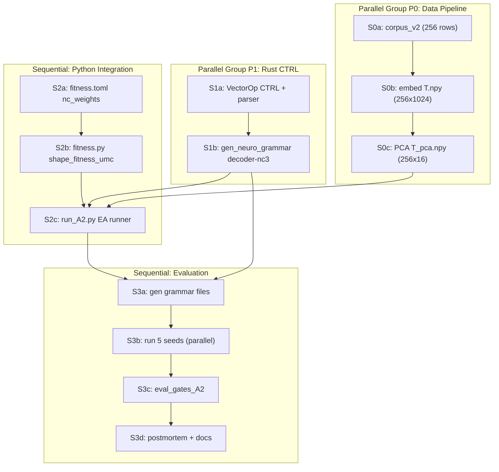

# A2 UMC Full Loop (NC1-4) on top of A1.1 PCA Space

Родительская ветка: `A1.1` (tag `gggp_bundle-medp/A1.1-success`).

## Мотивация

A1.1 операционализовала только **NC4** (Fixed-Point Stability):
`T_i ≈ D(G(T_i))` с F=0.92. Полный UMC требует добавить ещё три:

| neural constraint | смысл | что добавляет в PoC |
|---|---|---|
| **NC1** Recursive Closure | система самореферентна: код самовосстановим | `c_i ≈ G(D(c_i))` — дуальный fixed point |
| **NC2** Unitary Integration | композиция модальностей/контекстов | `D(α c_1 + β c_2)` ≈ смысл "смеси" `T_1 + T_2` |
| **NC3** Downward Causation | высший уровень влияет на низший | code c_i должен модулировать работу D (меняет операции) |
| **NC4** Fixed-Point Stability | базис | уже есть из A1.1, F=0.92 |

## Гипотеза A2

Одновременное удовлетворение NC1/NC2/NC3 поверх NC4 реализуемо в той же
axis-grammar на PCA-16, если:
  1. Добавить в fitness компоненты за NC1/NC2/NC3.
  2. Позволить decoder'у иметь input-ports, связанные с элементами `c`.
  3. Эволюционировать `(G, D)`-пару под **scalarized** fitness (взвешенная сумма; locked Q2).

Прогноз: F_raw слегка просядет (с 0.92 до 0.70-0.85), но средняя
композиция `D(c_1 + c_2)` будет семантически ближе к `(T_1 + T_2)`,
чем случайное усреднение.

## Архитектура

### NC1 -- дуальная реконструкция
- Новый цикл: `c_i → D(c_i) = T_i' → G(T_i') = c_i'`.
- Fitness slot: `F_nc1 = mean_i cos(c_i, c_i')` ∈ [-1, 1].
- Мотивация: if `D` и `G` друг другу обратны, код устойчив к
  «внутреннему шуму» — операционный аналог self-identity.

### NC2 -- композиционность пары
- Для случайной пары `(i, j)` и весов `α = β = 0.5`:
  `c_mix = α c_i + β c_j`; `T_mix = D(c_mix)`.
- Ground-truth композиции нет, поэтому proxy: `T_mix` должен быть
  ближе к ПОЛНОМУ пулу `{T_i + T_j}` чем к случайному `T_k`.
  Метрика: triplet loss.
  `F_nc2 = mean triplet( D(0.5 c_i + 0.5 c_j), (T_i + T_j)/2, T_k_rand )`.

### NC3 -- downward influence
- Расширяем грамматику decoder'а: вводим op `CTRL(axis, src_code_idx)`,
  которая берёт конкретную компоненту кода `c[src_code_idx]` и использует
  её как множитель `δ` в axis-shift. Это делает D-программу *функционально
  зависимой* от содержимого c_i, а не просто от input vector.
- Уже сейчас `batch_render_dual` прокидывает `c_i` как input vector
  в D-дерево — это *частично* NC3 (D видит c_i как starting state).
- Усиление: добавить в D-грамматику `SCALE_BY_CODE(k)` / `ADD_CODE(axis, k)`.

### NC4 (carry-over из A1.1)
- Оставляем raw reconstruction: `F_nc4 = mean_i cos(D(G(T_i)), T_i)`.

## Fitness (multi-objective scalarized)

```
F_shaped = F_nc4 - w_len * len_penalty
         - w_class * silhouette_penalty
         + w_nc1 * F_nc1
         + w_nc2 * F_nc2
         + w_nc3 * F_nc3_signal
```

Где `F_nc3_signal` = доля D-операций, которые реально зависят от `c`
(структурная метрика, чтобы НЕ премировать «симулякры»).

Все веса `w_*` идут в `config/fitness.toml` с заявленными эволюционными
диапазонами для будущей мета-оптимизации (user rule).

## Execution plan — unit decomposition (12 units)

Архитектура вычисления NC (вся интеграция на стороне Python, кроме новых op в Rust):

- **NC4** (carry-over): `F_nc4 = mean cos(T_i, D(G(T_i)))` — существующий `batch_render_dual`.
- **NC1** (dual fixed point): после `batch_render_dual` получаем `c_i`, затем цикл `render_tree_with_input(G, T_hat_i) -> c_hat_i`, далее `F_nc1 = mean cos(c_i, c_hat_i)`. Новый Rust batch API не требуется.
- **NC2** (композиционность): смесь `0.5*c_i + 0.5*c_j`, вызов `render_tree_with_input(D, c_mix) -> T_mix`, triplet loss относительно `(T_i+T_j)/2` и случайного `T_k`. Чистый Python.
- **NC3** (downward influence): считаем токены D-хромосомы `CTRL` / `SCALE_BY_CODE` / `ADD_CODE`; структурная метрика — анализ строки в Python. `F_nc3 = n_ctrl_ops / n_total_ops`.

Единственное изменение в Rust: новые op в `VectorOp` + парсер + исполнение + генерация грамматики.

### Dependency Graph



**Critical path**: `S1a -> S1b -> S2c -> S3a -> S3b -> S3c -> S3d = 210m (~3.5h)`.

P0 (~30m total) полностью параллелен P1, поэтому data pipeline вне critical path.

### Unit table

| id | title | deps | par | agent | est | artifacts_out |
|----|-------|------|-----|-------|-----|----------------|
| S0a | `build_corpus_v2.py`: 8×32=256 paraphrases | [] | P0 | opus-4.5 no low | 15m | `corpus_v2.jsonl` |
| S0b | `embed_corpus.py` on v2 → `T.npy` 256×1024 | [S0a] | P0 | composer-2-fast no low | 10m | `T.npy` |
| S0c | `pca_reduce.py` → `T_pca.npy` 256×16 | [S0b] | P0 | composer-2-fast no low | 5m | `T_pca.npy` |
| S1a | Rust: CTRL / SCALE_BY_CODE / ADD_CODE в VectorOp + парсер + execution | [] | P1 | opus-4.6 yes high | 60m | обновлённый `gggp` crate |
| S1b | `gen_neuro_grammar`: режим decoder-nc3 с CTRL ops | [S1a] | P1 | opus-4.6 yes medium | 15m | grammar artifacts |
| S2a | `config/fitness.toml`: секция `[nc_weights]` | [] | — | composer-2-fast no low | 5m | `fitness.toml` |
| S2b | `fitness.py`: `shape_fitness_umc()` NC1/NC2/NC3 | [S2a] | — | opus-4.6 yes medium | 30m | — |
| S2c | `run_A2.py`: EA runner, UMC fitness, 256 строк | [S0c, S1b, S2b] | — | opus-4.6 yes medium | 60m | `run_A2` outputs |
| S3a | Сгенерировать grammar + smoke test | [S1b, S2c] | — | composer-2-fast no low | 5m | — |
| S3b | Прогоны seeds 0–4 (5 параллельных) | [S3a] | P3 | 5× composer-2-fast no low | 20m | `best.json` per seed |
| S3c | `eval_gates_A2.py`: все гейты | [S3b] | — | opus-4.6 yes medium | 30m | gate report |
| S3d | Postmortem + `checkpoints.md` + `log.jsonl` + docs | [S3c] | — | opus-4.6 yes high | 20m | `postmortem.md` |

### CTRL Op Semantics (design for S1a)

```
CTRL(axis, code_idx):
    state[axis] += input[code_idx]   // input = c_i for decoder

SCALE_BY_CODE(code_idx):
    state *= input[code_idx]         // scalar broadcast

ADD_CODE(axis, code_idx):
    state[axis] += input[code_idx] * state[axis]  // multiplicative gating
```

`input` уже передаётся в `compile_tree_to_vector_with_input` как `Some(&c_i)` из `batch_render_dual`. CTRL-ops только индексируют его. `code_idx` ∈ `0..code_dim` (8 в PCA-режиме). `axis` ∈ `0..target_dim` (16 в PCA-режиме).

### Key files (reference)

- **S0a**: `scripts/build_corpus_v1.py` → копия `build_corpus_v2.py`, `PARAPHRASES_PER_SEED = 32`, вывод `corpus_v2.jsonl`.
- **S1a**: `rust/src/gggp/phenotype.rs` — enum `VectorOp`; `rust/src/gggp/vector.rs` — `collect_ops`, `compile_tree_to_vector_with_input`; токены `CTRL_ax_cidx`, `SBC_cidx`, `ADDC_ax_cidx`. `python_api.rs` без новых batch-методов.
- **S1b**: `rust/src/bin/gen_neuro_grammar.rs` — subcommand `decoder-nc3`; OP set = существующие 6 + `CTRL`, `SBC`, `ADDC`.
- **S2b**: `scripts/fitness.py` — `shape_fitness_umc()` (NC1 dual render, NC2 triplet, NC3 token fraction, scalarize).
- **S2c**: новый `scripts/run_A2.py` по образцу `run_A1.py`, корпус 256 строк, 5 seeds.

## Gates

| id | criterion | threshold | rationale |
|---|---|---|---|
| G_NC1 | `F_nc1 = mean cos(c, G(D(c)))` | > 0.50 | c должен быть «притяжим» через D-G loop |
| G_NC2 | triplet accuracy для композиций | > 0.55 | выше рандома (0.5) |
| G_NC3 | доля D-ops, зависящих от `c` | > 0.20 | не симулякр |
| G_NC4 | `F_nc4 = mean cos(T, D(G(T)))` | > 0.50 | сохраняет A1.1 качество (с запасом) |
| G_A2_stab | σ(F_overall) по 5 сидам | < 0.08 | чуть рыхлее A1.1 |
| G_A2_len | combined len | < 20 | больше чем A1.1 из-за NC3 ops |

## Риски

1. **NC3 cheating**: D может «притворяться» что использует `c`, но эффект
   операции на выход ничтожен. Митигация: контрольный запуск с
   randomized `c` — если F_nc4 не просел, значит D не реально зависит от c.
2. **NC2 тривиализация**: если `D(0.5 c_i + 0.5 c_j) ≈ (D(c_i) + D(c_j))/2`
   (D линеен), NC2 пройдёт бесплатно, но это не «настоящая» композиция.
   Митигация: ввести в грамматику `FRAC(f)`/`ROT` с нелинейным поведением.
3. **Многокритериальность**: взвешенная сумма может коллапсить в один
   критерий; залочено как основной режим (Q2). При провале гейтов —
   зафиксировать и рассмотреть NSGA-II как отдельный fork (+бюджет).

## Preserve on Fail

- Если G_NC1 FAIL, но G_NC4 PASS — откат к A1.1 как operational baseline,
  fork A2.1 с явным G→D→G loss в обратном направлении.
- Если G_NC3 FAIL — признак, что grammar expressivity снова упирается
  в потолок; fork A2.2 с learned projection (уходит от axis-grammar).
- Если всё FAIL кроме NC4 — фиксируем как empirical negative result,
  возврат к F0 с уточнением теории (может, weighted sum — не тот
  способ компоновать UMC-критерии).

## Locked Decisions (2026-04-22)

- **Q1 = 256**: new `corpus_v2.jsonl` (8 seeds × 32 paraphrases),
  re-fit PCA on 256×1024 → 256×16.
- **Q2 = scalarization**: weighted sum
  `F = w4*NC4 + w1*NC1 + w2*NC2 + w3*NC3 - penalties`, no NSGA-II.
- **Q3 = CTRL only**: add `CTRL(axis, code_idx)`, `SCALE_BY_CODE(k)`,
  `ADD_CODE(axis, k)`. No `GATED_OP` — сохраняем static tree validation.
