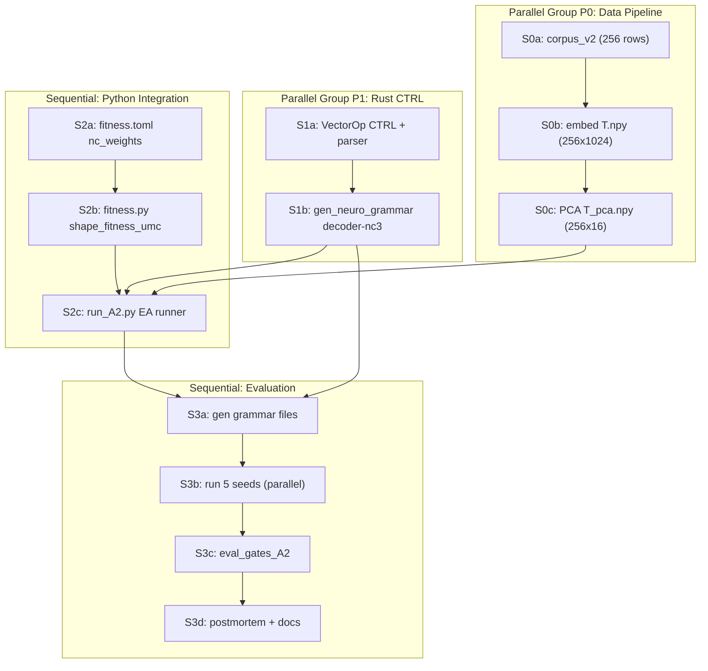

# A2 UMC Full Loop — Decomposed Execution Plan

## Locked Decisions

- **Q1 = 256**: new `corpus_v2.jsonl` (8 seeds x 32 paraphrases), re-fit PCA on 256x1024
- **Q2 = scalarization**: weighted sum `F = w4*NC4 + w1*NC1 + w2*NC2 + w3*NC3 - penalties`
- **Q3 = CTRL only**: `CTRL(axis, code_idx)`, `SCALE_BY_CODE(k)`, `ADD_CODE(axis, k)` — no `GATED_OP`

## Architecture Recap (NC computation — all Python-side)

- **NC4** (carry-over): `F_nc4 = mean cos(T_i, D(G(T_i)))` — existing `batch_render_dual`
- **NC1** (dual fixed point): after `batch_render_dual` gives `c_i`, loop `render_tree_with_input(G, T_hat_i) -> c_hat_i`, then `F_nc1 = mean cos(c_i, c_hat_i)`. No new Rust API needed.
- **NC2** (compositionality): Python mixes `0.5*c_i + 0.5*c_j`, calls `render_tree_with_input(D, c_mix) -> T_mix`, triplet loss vs `(T_i+T_j)/2` and random `T_k`. Pure Python.
- **NC3** (downward influence): count D-chromosome tokens that are `CTRL`/`SCALE_BY_CODE`/`ADD_CODE`. Structural metric — Python string analysis. `F_nc3 = n_ctrl_ops / n_total_ops`.

No new Rust batch methods required. Only Rust change: new ops in `VectorOp` + parser + execution + grammar gen.

## Dependency Graph



**Critical path**: S1a (60m) -> S1b (15m) -> S2c (60m) -> S3a (5m) -> S3b (20m) -> S3c (30m) -> S3d (20m) = **210m (~3.5h)**

P0 (30m total) runs fully parallel with P1, so data pipeline is off critical path.

## Unit Table

| id | title | deps | par | agent | est |
|----|-------|------|-----|-------|-----|
| S0a | build_corpus_v2.py: 8x32=256 paraphrases | [] | P0 | opus-4.5 no low | 15m |
| S0b | embed_corpus.py on v2 -> T.npy 256x1024 | [S0a] | P0 | composer-2-fast no low | 10m |
| S0c | pca_reduce.py -> T_pca.npy 256x16 | [S0b] | P0 | composer-2-fast no low | 5m |
| S1a | Rust: CTRL/SCALE_BY_CODE/ADD_CODE in VectorOp + parser + execution | [] | P1 | opus-4.6 yes high | 60m |
| S1b | gen_neuro_grammar: decoder-nc3 mode with CTRL ops | [S1a] | P1 | opus-4.6 yes medium | 15m |
| S2a | config/fitness.toml: add [nc_weights] section | [] | — | composer-2-fast no low | 5m |
| S2b | fitness.py: shape_fitness_umc() with NC1/NC2/NC3 terms | [S2a] | — | opus-4.6 yes medium | 30m |
| S2c | run_A2.py: EA runner with UMC fitness, 256 rows | [S0c, S1b, S2b] | — | opus-4.6 yes medium | 60m |
| S3a | Generate grammar files + smoke test | [S1b, S2c] | — | composer-2-fast no low | 5m |
| S3b | Run seeds 0-4 (5 parallel runs) | [S3a] | P3 | 5x composer-2-fast no low | 20m |
| S3c | eval_gates_A2.py: G_NC1/NC2/NC3/NC4/stab/len | [S3b] | — | opus-4.6 yes medium | 30m |
| S3d | Postmortem + checkpoints.md + log.jsonl + docs | [S3c] | — | opus-4.6 yes high | 20m |

## Key Files Changed

### S0a — corpus
- [scripts/build_corpus_v1.py](gggp_bundle/scripts/build_corpus_v1.py) -> copy to `build_corpus_v2.py`, change `PARAPHRASES_PER_SEED = 32`, output to `corpus_v2.jsonl`, update asserts

### S1a — Rust ops (hardest unit)
- [rust/src/gggp/phenotype.rs](gggp_bundle/rust/src/gggp/phenotype.rs): add `Ctrl(usize, usize)`, `ScaleByCode(usize)`, `AddCode(usize, usize)` to `VectorOp` enum
- [rust/src/gggp/vector.rs](gggp_bundle/rust/src/gggp/vector.rs):
  - `collect_ops`: parse tokens `CTRL_ax_cidx`, `SBC_cidx`, `ADDC_ax_cidx`
  - `compile_tree_to_vector_with_input`: new match arms; **key design**: ops must access `input` vector (which is `c_i` for decoder), so execution reads `input[code_idx]` as scalar multiplier
- No changes to [python_api.rs](gggp_bundle/rust/src/python_api.rs) — existing `batch_render_dual` already passes `c_i` as input to D

### S1b — grammar gen
- [rust/src/bin/gen_neuro_grammar.rs](gggp_bundle/rust/src/bin/gen_neuro_grammar.rs): add `decoder-nc3` subcommand; OP set = existing 6 + `CTRL`, `SBC`, `ADDC` with appropriate axis/code_idx ranges based on `code_dim`

### S2b — fitness
- [scripts/fitness.py](gggp_bundle/scripts/fitness.py): new `shape_fitness_umc()` that computes NC1 (dual render loop), NC2 (triplet), NC3 (token count), then scalarizes with config weights

### S2c — runner
- New `scripts/run_A2.py` based on [run_A1.py](gggp_bundle/scripts/run_A1.py): load 256-row corpus, use `shape_fitness_umc`, handle NC3 grammar, 5 seed support

## Gates (unchanged from draft)

| id | criterion | threshold |
|----|-----------|-----------|
| G_NC1 | `mean cos(c, G(D(c)))` | > 0.50 |
| G_NC2 | triplet accuracy for compositions | > 0.55 |
| G_NC3 | fraction of D-ops using CTRL | > 0.20 |
| G_NC4 | `mean cos(T, D(G(T)))` | > 0.50 |
| G_A2_stab | sigma(F_overall) across 5 seeds | < 0.08 |
| G_A2_len | combined chromosome len | < 20 |

## CTRL Op Semantics (design for S1a)

```
CTRL(axis, code_idx):
    state[axis] += input[code_idx]   // input = c_i for decoder

SCALE_BY_CODE(code_idx):
    state *= input[code_idx]         // scalar broadcast

ADD_CODE(axis, code_idx):
    state[axis] += input[code_idx] * state[axis]  // multiplicative gating
```

`input` is already passed to `compile_tree_to_vector_with_input` as `Some(&c_i)` by `batch_render_dual`. The CTRL ops just index into it. `code_idx` range = `0..code_dim` (8 in PCA mode). `axis` range = `0..target_dim` (16 in PCA mode).
