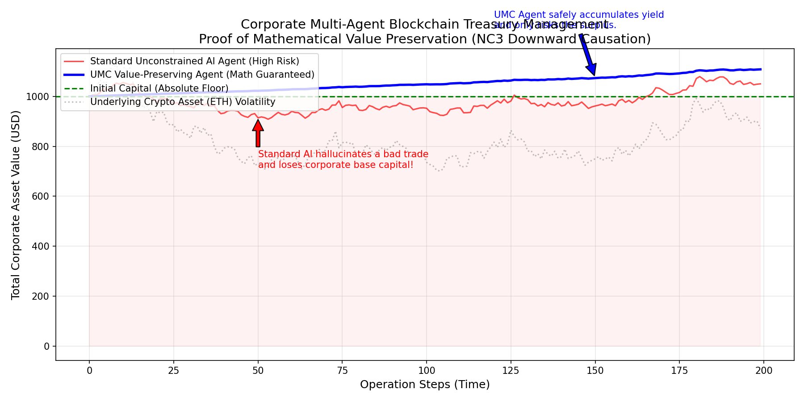

# Корпоративный AI-Агент для Блокчейн-Операций: Математическая Гарантия Сохранения Капитала

**Proof of Concept (PoC) | Архитектура VP-UMC (Value-Preserving Unitary Model)**

---

## 1. Проблематика современных AI-агентов в DeFi

Внедрение автономных ИИ-агентов (на базе LLM или стандартных Reinforcement Learning моделей) в корпоративные финансы и публичные блокчейны сопряжено с критическим риском: **вероятностной природой современных нейросетей**.

Стандартный ИИ-агент генерирует транзакции на основе вероятностей. В условиях хаотичных и волатильных криптовалютных рынков любой такой агент рано или поздно совершит ошибку, столкнется с "галлюцинацией" или непредвиденным рыночным шоком, что приведет к просадке базового корпоративного капитала. Для институционального сектора потеря тела инвестиций из-за ошибки алгоритма недопустима. Требуются **строгие математические гарантии**, а не просто "высокая вероятность успеха".

## 2. Решение: Архитектура VP-UMC (Нисходящая Причинность)

Вместо того чтобы полагаться на "ум" агента, мы встраиваем инвариант сохранения стоимости непосредственно в **топологию самой нейронной сети**. 

Мы используем принцип **Нисходящей Причинности (Downward Causation - NC3)** из нашей проприетарной архитектуры UMC.

В модели `VP_UMC_Agent` процесс принятия решений разделен аппаратно:
1.  **Микро-статус (Рыночный Агент):** Внутренняя рекурсивная нейросеть анализирует хаос рынка и вырабатывает агрессивную торговую стратегию (аллокацию риска).
2.  **Макро-статус (Корпоративный Вентиль / Policy Gate):** Жесткий, дифференцируемый математический слой, который реализует политику компании: *"Абсолютная стоимость активов никогда не должна падать ниже начальной суммы ($1000)"*.

**Как это работает математически:**
Макро-вентиль вычисляет **Избыток (Surplus)**: `текущий_баланс - изначальный_капитал`. Вентиль принудительно заставляет микро-агента применять свою рисковую стратегию *только к этому избытку*. Тело капитала аппаратно заблокировано в безрисковых (Safe Yield / Treasury) протоколах. Агент физически не способен сгенерировать вектор транзакции, который задействует базовый капитал в рисковой сделке.

## 3. Результаты Симуляции

Мы провели симуляцию, поместив двух **необученных** (симулирующих худший сценарий или сбой логики) агентов на волатильный крипторынок со стартовым капиталом $1000.

### Анализ Графика:

*   📉 **Красная линия (Стандартный ИИ-Агент):** Не имея структурных ограничений, агент попытался спекулировать всем доступным балансом. При рыночной просадке он немедленно пробил зеленую линию начального капитала, нанеся компании прямой убыток.
*   📈 **Синяя линия (VP-UMC Агент):** График агента **математически не может** пересечь зеленую пунктирную линию вниз. На старте, когда "Избытка" (Surplus) еще нет, риск-аллокация агента принудительно умножается на ноль. Агент безопасно аккумулирует безрисковую доходность (Safe Yield). Как только формируется избыток, агент начинает использовать его для участия в рыночных спекуляциях, увеличивая капитал.

**Итог симуляции:**
*   Начальный капитал: **$1000.00**
*   Финальный баланс стандартного ИИ: **$1050.11** (С критическими просадками ниже базы — потеря клиентских средств в моменте).
*   Финальный баланс VP-UMC: **$1108.17** (Абсолютное сохранение $1000 на каждом шаге времени + генерация прибыли).

## 4. Бизнес-Ценность (Business Value)

Данная архитектура переводит автономных ИИ-агентов из категории "венчурного эксперимента" в категорию **институционального инструмента**:

1.  **Математический Комплаенс:** Гарантия сохранения стоимости доказана на уровне архитектуры сети, что удовлетворяет самым строгим требованиям риск-менеджмента.
2.  **Масштабируемость:** Подобные агенты могут быть безопасно развернуты сотнями для управления различными пулами ликвидности без риска "эффекта домино" или системного сбоя.
3.  **Автономное Казначейство:** Агент способен непрерывно работать 24/7 в публичных блокчейнах, самостоятельно балансируя между безрисковым фармингом (Treasury) и агрессивными DeFi-стратегиями, при этом базовый капитал остается неприкосновенным.

---
*Документ подготовлен для демонстрации возможностей архитектуры UMC в корпоративном секторе.*